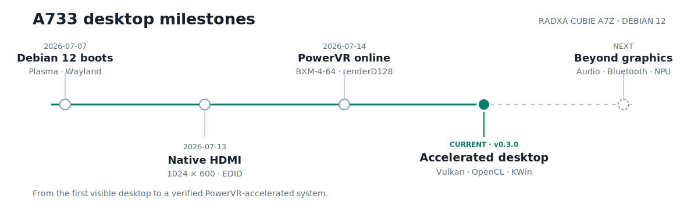
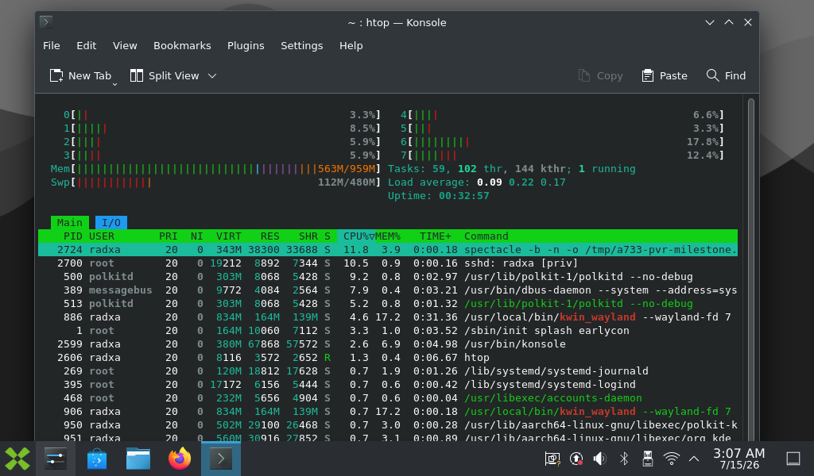
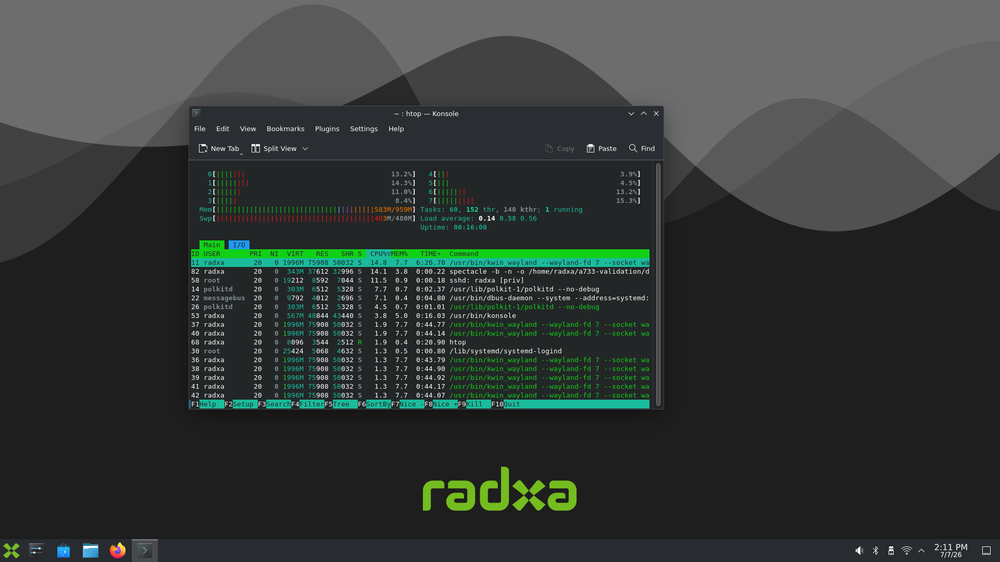
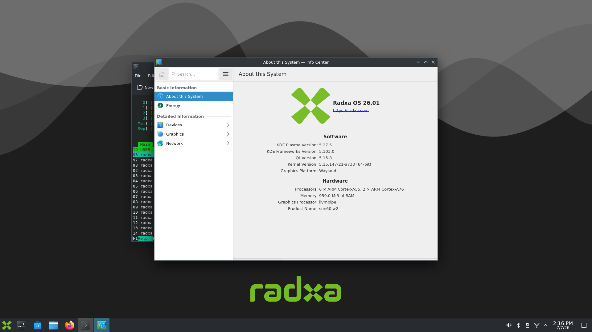
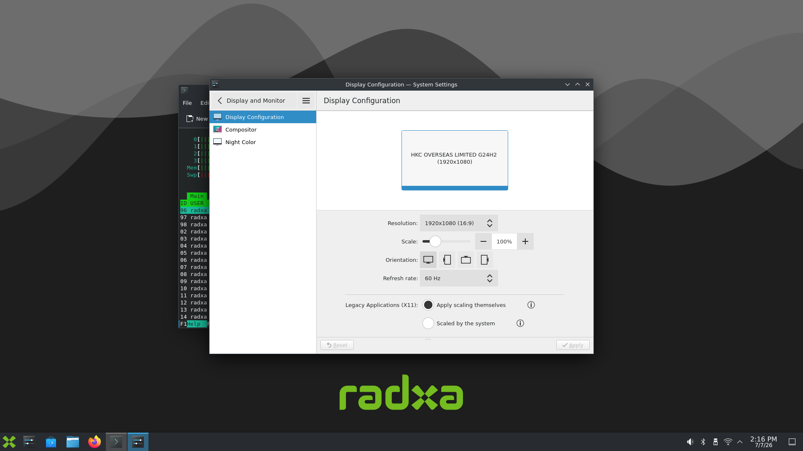
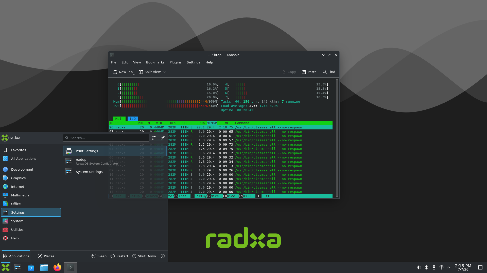

# radxa-a7z-display

[中文说明](README.zh-CN.md)

Debian 12 KDE Plasma Wayland, native HDMI output, and a reproducible PowerVR
GPU stack for Radxa A7Z/Z7A boards powered by Allwinner A733.


Product photo source: [Radxa Cubie A7Z documentation](https://docs.radxa.com/en/cubie/a7z).

## Latest Verified Milestone

`v0.3.0-a733-pvr-gpu` brings the PowerVR BXM GPU to the verified Debian 12
desktop stack. The release candidate and checksums are staged under
[`artifacts/releases/v0.3.0-a733-pvr-gpu`](artifacts/releases/v0.3.0-a733-pvr-gpu),
with the full technical record in
[A733 PowerVR GPU First Port](docs/releases/v0.3.0-a733-pvr-gpu.md).

Verified on a physical Radxa Cubie A7Z:

<!-- status-baseline:start -->
| Item | Verified result |
| --- | --- |
| Board | Radxa Cubie A7Z / Allwinner A733 |
| Operating system | Debian 12 Bookworm · KDE Plasma Wayland |
| Kernel | `5.15.147-21.1-a733` · package `5.15.147-21.1+display2` |
| GPU package | `a733-pvr-gpu 24.2.6603887+gpu6` |
| GPU | PowerVR B-Series BXM-4-64 · DDK `24.2@6603887` |
| Graphics APIs | Vulkan · OpenCL 3.0 · EGL/GBM · OpenGL ES 3.2 |
| Desktop renderer | PowerVR-accelerated KWin / Plasma Wayland |
| Display | `FLY-HDMI-LCD7` · `1024x600@60Hz` · scale 100% |
| Network | AIC8800 Wi-Fi and SSH working |
| Display policy | EDID preferred/native timing; no forced Full HD |
| Recovery | Custom stack on `l0` · vendor kernel retained on `l1` |
<!-- status-baseline:end -->

Release assets include the installable GPU `.deb`, a guarded deployment
script, bilingual release notes, and SHA256 checksums.

## Milestone: The A733 GPU Is Awake



**This is the moment the A7Z crossed from “it boots” to “the hardware is
alive.”** The same Debian 12 desktop that originally rendered through
`llvmpipe` now runs KWin on the PowerVR B-Series BXM-4-64. The kernel module,
matched firmware, vendor userspace, render node, compute APIs, and real Plasma
Wayland session have all passed validation on the physical board.

| First desktop boot | PowerVR milestone |
| --- | --- |
| Software renderer: `llvmpipe` | Hardware renderer: `PowerVR B-Series BXM-4-64` |
| Display-only `/dev/dri/card0` | Display KMS plus `card1` and `renderD128` acceleration nodes |
| GPU power present but unused | `pvrsrvkm` and BVNC-matched firmware load automatically |
| Desktop output proven | Vulkan, OpenCL 3.0, EGL/GBM, GLES 3.2, and KWin proven |



The GPU stack remains deliberately isolated under
`/opt/a733-pvr/24.2.6603887`, preserves the distribution Xorg stack, keeps HDMI
scanout on `/dev/dri/card0`, and retains the vendor kernel as the `l1` recovery
path. This is not a one-off library replacement: it is packaged, deployable,
reversible, and backed by a repeatable validation record.

## Project Background

I bought a Radxa A7Z in December 2025 because the Allwinner A733 looked unusually strong for its class: an 8-core CPU with 2x Cortex-A76 and 6x Cortex-A55 cores, an Imagination PowerVR GPU, and a 3 TOPS INT8 NPU in a very small board. At the time, the entry A733 boards were priced like budget hobby boards, while the Raspberry Pi-shaped Radxa A7Z 4GB model was still far cheaper than many boards with weaker practical performance. Compared with common RK3566 boards such as the Orange Pi 3B and CM4-style alternatives, the A733 platform looked like a much better performance-per-money target.

The hardware was attractive, but the software situation was not. After buying the board, I found that official system updates were slow. The only officially useful GUI image was an archived Debian 11 build, while newer Debian desktop images were either missing or not in a usable release state for HDMI desktop use.

This project exists to unlock that hardware. The first goal was simple and concrete: make the Radxa A7Z / A733 boot a modern Debian desktop with HDMI output. We now have a Debian 12 Bookworm KDE image that boots, starts SDDM, reaches Plasma Wayland, and selects the connected display's EDID preferred mode. The initial 1080p desktop path and the corrected `FLY-HDMI-LCD7` native `1024x600` path have both run on real hardware; final-kernel regression coverage on additional monitors remains open.

That first successful desktop boot was the point where this stopped being only a research note. PowerVR acceleration is now the second major breakthrough: the board has moved from software-rendered pixels to a hardware-accelerated Plasma Wayland desktop with Vulkan and OpenCL. NPU enablement, audio validation, broader display testing, and BSP cleanup remain, but the most important desktop path is now real. If you bought this board for the same reason, or if you think the A733 still has more potential than its official software support suggests, this repository is meant to be a practical place to continue that work.

## Capability Status

This table is the short, practical view of what currently works and what still needs work on the Debian 12 KDE image.

<!-- status-table:start -->
Status: ✅ working · 📘 documented · 🧪 awaiting validation · 🚧 in progress · ⬜ not started

| Area | Current status | Notes |
| --- | --- | --- |
| Debian 12 Bookworm boot | ✅ Working | RSDK-based image boots from SD on Radxa Cubie A7Z/A733. |
| HDMI desktop output | ✅ Working | Plasma Wayland reaches HDMI-A-1 and follows the EDID preferred/native timing. |
| Display manager | ✅ Working | SDDM reaches the graphical login and desktop path. |
| Default user login | ✅ Working | Username and password are both `radxa`. |
| Wi-Fi and SSH | ✅ Working | AIC8800 Wi-Fi and SSH are verified with the full display/GPU stack. |
| Serial console | 📘 Documented | UART0 on the 40-pin header is documented for boot and recovery diagnostics. |
| Root filesystem expansion | ✅ Working | Rootfs expands to the SD card and mounts from `mmcblk0p3`. |
| Windows-friendly image release | ✅ Working | `v0.3.0` packages Debian 12 KDE, the display kernel, PowerVR acceleration, and an independent vendor recovery entry in one XZ image. |
| Small-screen native mode | ✅ Working | `FLY-HDMI-LCD7` runs at native `1024x600@60Hz` without stretching or cropping. |
| Full display kernel package | ✅ Working | `5.15.147-21.1+display2` boots from `l0`; recovery remains on `l1`. |
| GPU acceleration | ✅ Working (first port) | `pvrsrvkm`, Vulkan, OpenCL, EGL/GBM, and PowerVR-accelerated KWin are verified with the isolated `gpu6` environment. |
| GPU desktop environment isolation | ✅ Working | Plasma, Discover, KScreenLocker, and XWayland no longer inherit the PowerVR library environment; KWin remains accelerated. |
| XWayland acceleration | 🚧 In progress | A render-node linux-dmabuf feedback override removes XWayland 24.1.6's missing-render-node error, but PowerVR EGL/glamor still falls back and GLX uses llvmpipe. |
| DRM render node | ✅ Working | PowerVR provides `/dev/dri/card1` and `renderD128`; HDMI KMS remains on `card0`. |
| HDMI audio | 🧪 Not validated | Audio devices are visible; playback and HDMI audio quality still need testing. |
| Bluetooth | 🧪 Not validated | Controller visibility, pairing, and audio profiles still need validation. |
| NPU | ⬜ Not started | A733 NPU enablement and validation have not started. |
| BSP/kernel cleanup | 🚧 In progress | Vendor kernel logs still contain warnings and missing-module messages. |
| Debian 13 / Trixie | ⬜ Not started | Debian 12 remains the current priority and verified desktop target. |
<!-- status-table:end -->

## What this repository is for

- Collect and preserve research notes about A733 display support.
- Record the technical constraints around Debian 12 desktop bring-up.
- Track implementation decisions, validation steps, and long-term maintenance rules.
- Keep English source documents and Chinese translations side by side.

## Document map

- [Project Overview](docs/project-overview.md)
- [Current Status](docs/status.md)
- [Display Landscape Research](docs/research/a733-display-landscape.md)
- [A733 GPU Acceleration Driver Feasibility](docs/research/a733-gpu-acceleration-feasibility.md)
- [A733 PowerVR GPU First Activation](docs/validation-records/2026-07-14-a733-pvr-gpu-first-activation.md)
- [A733 PowerVR Desktop Environment Isolation](docs/validation-records/2026-07-16-a733-pvr-environment-isolation.md)
- [A733 XWayland 24.1.6 Glamor Test](docs/validation-records/2026-07-16-a733-xwayland-24.1.6-test.md)
- [A733 PowerVR GPU First-Port Release](docs/releases/v0.3.0-a733-pvr-gpu.md)
- [A733 PowerVR GPU Hardening Roadmap](docs/roadmap/a733-pvr-gpu-hardening.md)
- [Display Stack Architecture](docs/architecture/display-stack.md)
- [Contributing Guide](docs/contributing.md)
- [Naming Conventions](docs/naming-conventions.md)
- [Validation Guide](docs/validation.md)
- [Validation Record Template](docs/validation-template.md)
- [Validation Example](docs/examples/radxa-a7z-first-hdmi-example.md)
- [Radxa RSDK vs Orange Pi A733](docs/comparison/radxa-rsdk-vs-orangepi-a733.md)
- [A7Z Debian 12 Report Format](docs/a7z-debian12-report-format.md)
- [Small HDMI Panel Mode Selection](docs/experiments/a733-small-hdmi-panel-mode-selection.md)
- [Full Display Kernel Release](docs/releases/v0.2.1-a733-full-kernel-display.md)
- [A7Z Debian 12 Trial Checklist](docs/experiments/a7z-debian12-checklist.md)
- [A7Z Serial Console and Recovery](docs/a7z-serial-console.md)
- [Decision Log](docs/decision-log.md)
- [Sources Index](docs/sources.md)

## Tools

- `python3 tools/a733_compare.py compare <left-source-tree> <right-source-tree> --left-label <name> --right-label <name> --output report.md`
- `python3 tools/a733_compare.py check <source-tree> --output report.md`
- The tool scans board configs, family configs, and AArch64 DTS files, then renders a Markdown comparison report or a minimum-tree check report.
- `python3 tools/a7z_debian12_report.py <radxa-rsdk-tree> <orangepi-build-tree> --output report.md`
- This tool turns the Radxa/Orange Pi source trees into an A7Z Debian 12 migration report.
- `patches/a733-bsp/0001-drm-prefer-edid-native-mode.patch` removes A733's forced-FHD policy and makes the vendor DRM driver select the EDID preferred mode before falling back to the first advertised mode.
- `tools/package_a733_kernel_display.sh INPUT.deb OUTPUT.deb` adds the A7Z initramfs size workaround and produces the installable `+display2` kernel package.
- `sudo tools/deploy_a733_display_kernel.sh PACKAGE.deb --activate` installs one package under a lock and verifies DKMS and initramfs safety gates before selecting `l0`.
- `tools/download_a733_gpu_vendor.sh DIR` downloads and verifies the pinned A733 PowerVR packages.
- `tools/build_a733_gpu_module.sh DKMS.deb KERNEL_TREE OUTPUT.ko` builds and validates `pvrsrvkm`.
- `tools/package_a733_gpu.sh MODULE.ko USERSPACE.deb OUTPUT.deb` builds a GPU package without replacing Xorg.
- `sudo tools/deploy_a733_gpu.sh PACKAGE.deb --activate` installs it while preserving recovery entry `l1`.
- `python3 tools/render_status.py` regenerates README status blocks and both current-status documents from `docs/status.json`.
- `python3 tools/render_status.py --check` verifies that generated status documentation is current.

## Maintenance rules

- English documents are the source of truth.
- Every core document must have a matching `.zh-CN.md` translation.
- `docs/status.json` is the only editable source for current progress; generated status blocks and documents must not be edited directly.
- Keep decisions in the decision log, not scattered across notes.
- Add sources for any hardware, BSP, or release claim before treating it as a project fact.
- Keep the docs practical and lightweight. This is a personal project first, with collaborators welcome but not required.

## Current status

<!-- status-summary:start -->
- Repository: published and maintained on GitHub.
- Verified image: [`v0.1.1-a733-debian12-kde-raw`](https://github.com/cuihuir/radxa-a7z-display/releases/tag/v0.1.1-a733-debian12-kde-raw).
- Display kernel: [`v0.2.1-a733-full-kernel-display`](https://github.com/cuihuir/radxa-a7z-display/releases/tag/v0.2.1-a733-full-kernel-display).
- GPU image: [`v0.3.0-a733-pvr-gpu`](https://github.com/cuihuir/radxa-a7z-display/releases/tag/v0.3.0-a733-pvr-gpu), combining the verified display kernel and first PowerVR port.
<!-- status-summary:end -->

## Download

The current integrated GPU image is available from
[`v0.3.0-a733-pvr-gpu`](https://github.com/cuihuir/radxa-a7z-display/releases/tag/v0.3.0-a733-pvr-gpu):

- Image: `radxa-a733-debian12-kde-pvr-20260716.img.xz`
- Includes the `display2` kernel, PowerVR `gpu4` stack, KDE stability setting,
  and an independent vendor-kernel `l1` recovery entry.
- The filesystem and image layout pass offline validation. The assembled image
  still needs a clean reflash test on a separate SD card.

The original verified base image remains available from
[`v0.1.1-a733-debian12-kde-raw`](https://github.com/cuihuir/radxa-a7z-display/releases/tag/v0.1.1-a733-debian12-kde-raw):

- Image: `radxa-a733-debian12-kde-20260713.img.xz`
- Checksum file: `SHA256SUMS`
- The XZ asset decompresses to the exact RSDK `output.img` that booted on the
  physical A7Z. Its GPT layout and partition attributes are unchanged.

`v0.1.0-a733-debian12-kde` remains withdrawn. Its PiShrink-processed image
does not boot on the A7Z; do not flash it.

On Linux, decompress and flash either release with:

```bash
xz -d radxa-a733-debian12-kde-pvr-20260716.img.xz
sudo dd if=radxa-a733-debian12-kde-pvr-20260716.img of=/dev/<target-disk> bs=4M status=progress conv=fsync
sync
```

On Windows, try writing the `.img.xz` directly with Rufus or balenaEtcher. If the writer does not accept `.xz`, decompress it first and write the resulting `.img`.

## Install The Full Display Kernel

Boot the Debian 12 image first, then download these assets from
[`v0.2.1-a733-full-kernel-display`](https://github.com/cuihuir/radxa-a7z-display/releases/tag/v0.2.1-a733-full-kernel-display):

- `linux-image-5.15.147-21.1-a733_5.15.147-21.1+display2_arm64.deb`
- `deploy_a733_display_kernel.sh`
- `SHA256SUMS`

Verify and install on the A7Z:

```bash
sha256sum -c SHA256SUMS
chmod +x deploy_a733_display_kernel.sh
sudo ./deploy_a733_display_kernel.sh \
  linux-image-5.15.147-21.1-a733_5.15.147-21.1+display2_arm64.deb \
  --activate
sudo reboot
```

The installer deliberately runs one foreground `dpkg`/DKMS sequence under a
lock. Do not start another package or DKMS command while it is running, even if
the terminal temporarily produces no output.

After reboot:

```bash
uname -r
dpkg -s linux-image-5.15.147-21.1-a733 | grep -E '^(Status|Version):'
ip -brief address show wlan0
sudo journalctl -b -k --no-pager \
  | grep -E 'Configuration mode|drm hdmi mode set'
```

Expected on the tested small panel:

```text
5.15.147-21.1-a733
Version: 5.15.147-21.1+display2
HDMI-A-1: Configuration mode 1024x600@60Hz
drm hdmi mode set: 1024*600
```

## Recovery

The vendor kernel remains available as `l1`. If the custom entry does not
boot, mount the SD card on another Linux system and change the default entry:

```bash
sudo mount /dev/<root-partition> /mnt/a7z-root
sudo sed -i 's/^default l0$/default l1/' \
  /mnt/a7z-root/boot/extlinux/extlinux.conf
sync
sudo umount /mnt/a7z-root
```

The full failure analysis, including the initramfs size issue and the DKMS
concurrency incident, is recorded in
[A733 Small HDMI Panel Mode Selection](docs/experiments/a733-small-hdmi-panel-mode-selection.md).

## First Successful Debian 12 KDE Boot

Date: 2026-07-07

We built a Debian 12 Bookworm KDE image for Radxa Cubie A7Z / A733 from the Radxa RSDK path, flashed it to an SD card, booted the board, and reached a working HDMI Plasma desktop.

Observed on the board:

- Board hostname: `radxa-cubie-a7z`
- Login: `radxa` / `radxa`
- OS: Debian GNU/Linux 12 Bookworm
- Kernel: `5.15.147-21-a733`
- Desktop: KDE Plasma 5.27.5 on Wayland
- Display path: HDMI-A-1, 1920x1080 at 60 Hz
- Display manager: SDDM
- Network: Wi-Fi connected, SSH reachable at `192.168.123.210` during validation
- Storage: rootfs expanded to the SD card, `/` mounted on `mmcblk0p3`

Evidence:









Known gaps recorded at first boot (GPU items were resolved on 2026-07-14):

- Graphics acceleration was not yet proven. `glxinfo` and Info Center reported `llvmpipe`; the PowerVR milestone above supersedes this result.
- Only `/dev/dri/card0` was present in this historical validation; `card1` and `renderD128` are now created by the PowerVR stack.
- `xdg-desktop-portal` and `xdg-desktop-portal-kde` were inactive in the user session during the first check.
- Kernel logs contain vendor/BSP warnings, including debug-kernel notices, GPU power-domain probe timeout messages, audio/HDMI warnings, and some missing module entries.
- Audio devices are visible through PipeWire/ALSA, but playback quality was not tested yet.

Detailed record:

- [2026-07-07 A733 Debian 12 KDE first boot validation](docs/validation-records/2026-07-07-a733-debian12-kde-first-boot.md)
